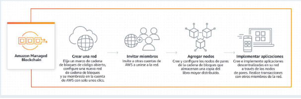

# **MODULO 15: OTRAS CARACTERÍSTICAS DE LA NUBE**

## **Terminología tecnológica.**

|**Término**|**Definición**|
| - | - |
|**Cadena de bloques**|Tecnología de base de datos descentralizada que mantiene un conjunto de transacciones y contratos inteligentes en continuo crecimiento, reforzada contra la manipulación y la revisión mediante criptografía (es una práctica que consiste en proteger información mediante el uso de algoritmos codificados, hashes y firmas)|
|**Bloque**|Lista creciente de registros en una cadena de bloques.|
|**Transacción**|Intercambio, generalmente de divisas, en una cadena de bloques.|
|**Libro de contabilidad**|Registro digital de transacciones.|
|**Inmutable**|Capacidad de una cadena de bloques para permanecer sin cambios.|
|**Confianza**|Confianza en la precisión diseminada entre los usuarios de cadenas de bloques.|
|**Transparencia**|Registro transparente y abierto de las transacciones.|

## **Antecedentes y conceptos erróneos**

**Amazon Athena**

- Athena es un servicio de consultas interactivo que facilita el análisis de datos en Amazon Simple Storage Service (Amazon S3) y usa el lenguaje de consulta estructurada estándar (SQL).
- Athena no usa servidor, por lo que no hay una infraestructura que administrar, y los usuarios pagan solo por las consultas que ejecutan. Los usuarios pueden consultar sus datos con rapidez sin tener que configurar ni administrar ningún servidor ni almacén de datos. También pueden apuntar a sus datos en Amazon S3, definir el esquema y comenzar a realizar consultas con el editor de consultas incorporado. Athena permite a los usuarios acceder a todos sus datos en S3 sin necesidad de configurar procesos complejos de extracción, transformación y carga (ETL) de los datos.
- Athena es fácil de usar, no es necesario realizar trabajos de ETL complejos para preparar los datos para el análisis. Esto facilita que cualquier persona con conocimientos de SQL analice rápidamente conjuntos de datos a gran escala.
- Athena se integra de inmediato con el catálogo de datos de AWS Glue, lo que permite a los usuarios crear un repositorio de metadatos unificado entre distintos servicios, rastrear orígenes de datos para descubrir esquemas, completar el catálogo de datos con definiciones de tablas y particiones nuevas y modificadas, y mantener el control de versiones del esquema. Los usuarios también pueden utilizar las capacidades de ETL completamente administradas de AWS Glue para transformar los datos o convertirlos en formatos de columnas a fin de optimizar el costo y mejorar el rendimiento.
- Con Athena, los usuarios solo pagan por las consultas que ejecutan. Los usuarios pueden ahorrar entre un 30 y un 90 por ciento en costos por consulta y obtener un mejor rendimiento al comprimir los datos, particionarlos y convertirlos en formatos de columnas. Athena consulta los datos directamente en Amazon S3. No se aplican cargos adicionales por almacenamiento más allá de S3.
- Athena utiliza Presto que admite ANSI SQL y trabaja con diversos formatos de datos estándar, como CSV, notación de objetos JavaScript (JSON), Apache ORC, Apache Avro y Apache Parquet. Athena es ideal para consultas rápidas y de uso único, pero también puede manejar análisis complejos, como uniones de gran tamaño, funciones de ventana y matrices. Athena tiene una alta disponibilidad y ejecuta consultas utilizando recursos informáticos en múltiples instalaciones y múltiples dispositivos en cada instalación. Athena utiliza Amazon S3 como almacén de datos subyacente, lo que hace que los datos estén siempre disponibles y sean duraderos.
- Con Athena, los usuarios no tienen que preocuparse por tener suficientes recursos informáticos para obtener un rendimiento de consulta rápido e interactivo. Athena ejecuta consultas de manera simultánea automáticamente, por lo que la mayoría de los resultados se obtienen en cuestión de segundos.

**Amazon Macie**

- Macie es un servicio de seguridad que utiliza machine learning para detectar, clasificar y proteger automáticamente la información confidencial en AWS. Macie reconoce datos confidenciales, como la información de identificación personal (PII) o la propiedad intelectual, y proporciona paneles y alertas que dan visibilidad a la forma en que se mueven estos datos o se accede a ellos. El servicio completamente administrado supervisa continuamente la actividad de acceso a los datos en busca de anomalías y genera alertas detalladas cuando detecta algún riesgo de acceso no autorizado o de fuga de datos inadvertida. Macie está disponible para proteger los datos almacenados en Amazon S3, y pronto será compatible con otros almacenes de datos de AWS.
- Macie permite que los administradores de seguridad puedan ver los entornos de almacenamiento de datos en S3, y próximamente permitirá hacerlo en otros almacenes de datos de AWS.
- Macie utiliza machine learning para automatizar el proceso de detección, clasificación y protección de los datos almacenados en AWS. Esto permite comprender mejor dónde se almacena la información confidencial y cómo se accede a ella, lo que incluye la autenticación del usuario y los patrones de acceso.
- Macie puede enviar todos los resultados a Amazon CloudWatch Events. De este modo, los usuarios pueden crear soluciones personalizadas y gestiones de alertas para los sistemas de tickets de seguridad existentes.

**Cadena de bloques y Amazon Managed Blockchain**

- Una cadena de bloques es una forma de administrar un libro de contabilidad abierto y distribuido de transacciones. Un libro de contabilidad es un tipo de base de datos en el que las transacciones solo se anexan, nunca se modifican, lo que lo hace inmutable y de confianza porque no hay forma de alterar los registros. Una transacción es el registro de algún evento en el que se transfiere la propiedad o la tenencia. Un ejemplo de transacción es la transferencia de dinero de una cuenta a otra. El objetivo principal de una cadena de bloques es eliminar una autoridad central o un intermediario para agilizar el proceso.
- Una cadena de bloques es una lista creciente de registros, como una base de datos, denominados *bloques*, que están vinculados mediante criptografía. Cada bloque contiene información sobre el bloque anterior, la fecha y la hora, y los datos de la transacción. La cadena de bloques comenzó con el desarrollo de las criptomonedas y ahora se ha extendido a nuevos productos y servicios.
- Con ella se pueden crear aplicaciones en las que varias partes pueden ejecutar transacciones sin necesidad de contar con una autoridad central de confianza. En la actualidad, la creación de una red de cadenas de bloques escalable con las tecnologías existentes es compleja de configurar y difícil de administrar. Para crear una red de cadenas de bloques, cada miembro de la red tiene que aprovisionar el hardware de forma manual, instalar el software, crear y administrar los certificados para el control de acceso, y configurar los componentes de las redes. Una vez que la red de cadenas de bloques está en funcionamiento, es necesario monitorear constantemente la infraestructura y adaptarse a los cambios, como el aumento de las solicitudes de transacciones o la entrada o salida de nuevos miembros de la red.
- Managed Blockchain es un servicio completamente administrado que permite a los usuarios configurar y administrar una red de cadenas de bloques escalable con unos pocos clics. Managed Blockchain elimina la sobrecarga necesaria para crear la red y se adapta automáticamente a la demanda de miles de aplicaciones que ejecutan millones de transacciones. Una vez que la red está en funcionamiento, Managed Blockchain facilita la administración y el mantenimiento de la red de cadenas de bloques. Administra los certificados y permite que los usuarios inviten a nuevos miembros a unirse a la red con facilidad.
- Managed Blockchain es un servicio que ayuda a elegir y aprovisionar otros servicios de AWS junto con servicios ajenos a AWS, como Ethereum, para implementar una cadena de bloques. Mediante una serie de preguntas estructuradas, Managed Blockchain guía el proceso de elección de los servicios necesarios para implementar uno de los varios tipos de cadena de bloques.
- Con Managed Blockchain, los usuarios pueden crear rápidamente redes de cadenas de bloques que abarcan varias cuentas de AWS, permitiendo a un grupo de miembros ejecutar transacciones y compartir datos sin una autoridad central. A diferencia del autoalojamiento de una infraestructura de cadena de bloques, Managed Blockchain elimina la necesidad de aprovisionar manualmente el hardware, configurar el software y establecer los componentes de red y seguridad. Con la interfaz de programa de aplicación (API) de votación de Managed Blockchain, los participantes de la red pueden realizar votaciones para agregar o eliminar miembros. Después de agregar un nuevo miembro, Managed Blockchain permite a ese miembro lanzar y configurar varios nodos de pares de cadenas de bloques para procesar las solicitudes de transacción y guardar una copia del libro mayor. Managed Blockchain también monitorea la red y reemplaza automáticamente los nodos con bajo rendimiento.
- Managed Blockchain admite dos marcos de cadena de bloques populares: Hyperledger Fabric y Ethereum. Hyperledger Fabric es adecuado para aplicaciones que requieren estrictos controles de privacidad y permisos con un conjunto conocido de miembros; por ejemplo, una aplicación financiera en la que ciertos datos relacionados con el comercio solo se comparten con determinados bancos. Ethereum es apropiado para redes de cadenas de bloques de gran distribución en las que la transparencia de los datos es importante para todos los miembros; por ejemplo, una red de cadenas de bloques de fidelización de clientes que permita a cualquier minorista de la red verificar de forma independiente la actividad de un usuario entre todos los miembros para canjear beneficios. Como alternativa, se puede utilizar Ethereum para unirse a una red pública de cadenas de bloques Ethereum. Ethereum y Hyperledger Fabric son productos de empresas externas a AWS.
- Managed Blockchain puede escalar fácilmente su red de cadenas de bloques a medida que el uso de las aplicaciones en la red crece con el tiempo. Cuando un miembro de la red necesita capacidad adicional para crear y validar transacciones, puede agregar un nuevo nodo del mismo nivel con rapidez por medio de las API de Managed Blockchain. Managed Blockchain ofrece una selección de tipos de instancias que comprenden distintas combinaciones de unidades centrales de procesamiento (CPU) y de memoria para aportar flexibilidad a la hora de elegir la combinación adecuada de recursos según la carga de trabajo. Además, Managed Blockchain asegura los certificados de la red con la tecnología de AWS Key Management Service (AWS KMS), por lo que los usuarios no tienen que configurar su propio almacenamiento de claves de seguridad.

 

Las tecnologías de cadenas de bloques suelen utilizarse para resolver dos tipos de necesidades de los clientes. En el primer caso, varias partes trabajan con una autoridad centralizada y de confianza para mantener un registro completo y verificable de las transacciones. Un ejemplo es un cliente minorista que desea vincular a sus proveedores con un libro de contabilidad centralizado en el que se mantenga un historial transparente y verificable de la información relacionada con el movimiento de un producto a través de la cadena de suministro.

En el otro caso, varias partes realizan transacciones por separado sin necesidad de una autoridad centralizada y de confianza. Por ejemplo, un consorcio de bancos y casas de exportación que desean realizar transferencias internacionales de activos (como cartas de crédito) entre sí, sin que haya una autoridad centralizada que actúe como intermediaria.

